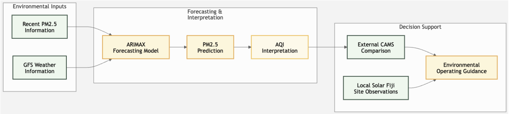
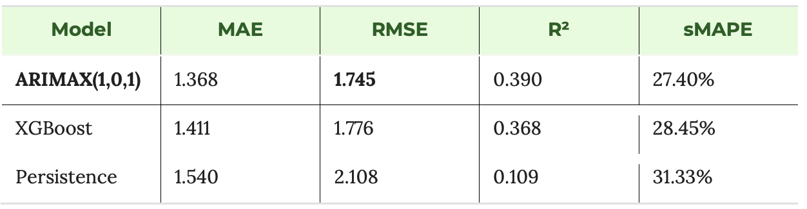
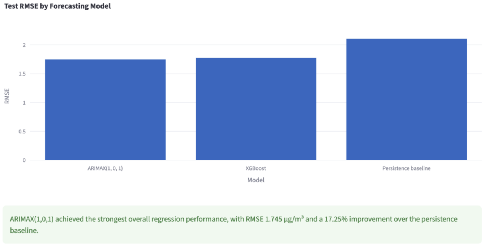
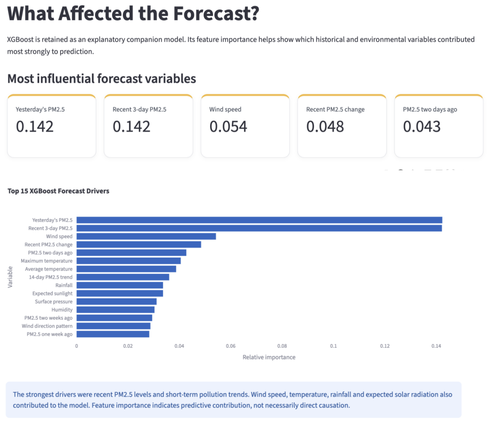
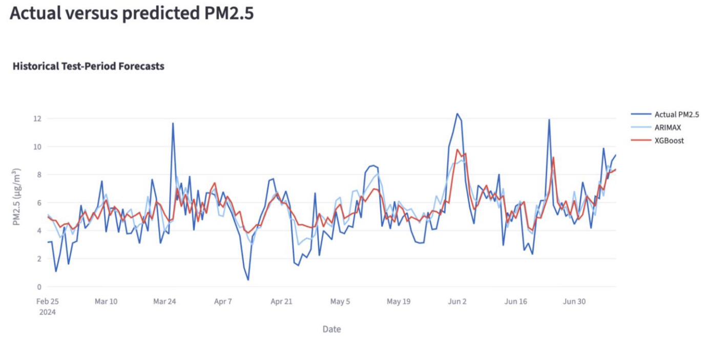
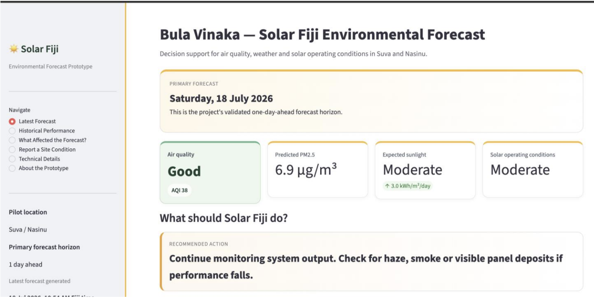
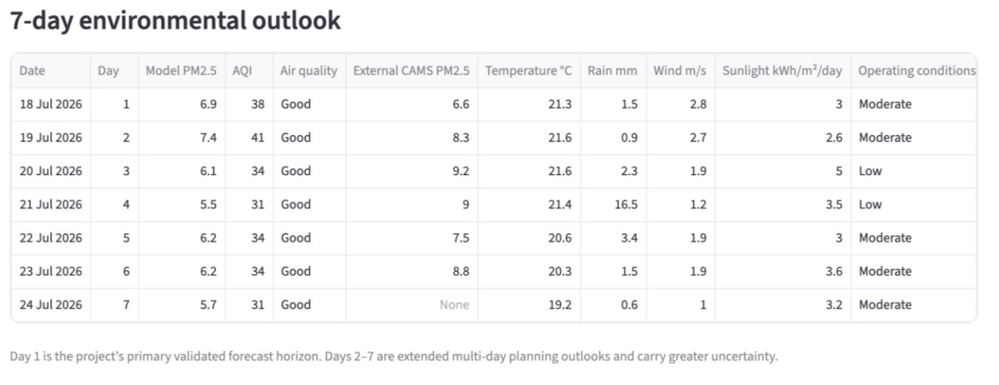
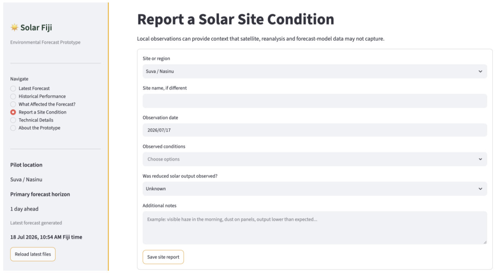

# AI-Based Air Quality Forecasting for Solar Fiji 🌞🌱

## Think Pacific x Solar Fiji Action Project

**Project Reference:** 57-15  
**Project Title:** Air Quality Index Prediction – Forecasting Pollution Levels Based on Environmental Data and AI Analytics

---

## Project Overview

This project was developed as part of an 8-week Action Project Internship with **Think Pacific**, in collaboration with **Solar Fiji**.

The aim of this project was to develop an AI-driven forecasting system capable of predicting air quality conditions and understanding how environmental changes may influence solar energy operations.

Poor air quality conditions, such as increased dust, smoke, or pollution levels, can reduce solar panel efficiency by affecting the amount of sunlight reaching photovoltaic surfaces. This project explores how environmental forecasting can support better planning and decision-making for solar operations.

---

# Project Objectives

The main objectives of this project were:

- Develop an AI-based Air Quality Index (AQI) forecasting system
- Predict future PM2.5 pollution levels using environmental data
- Integrate weather and air-quality information
- Evaluate forecasting approaches using time-series and machine-learning methods
- Create a dashboard prototype for practical interpretation
- Provide environmental guidance relevant to Solar Fiji operations

---

# Project Workflow

The developed system follows the workflow:

Environmental Data Collection  
↓  
Data Processing and Analysis  
↓  
AI Forecasting Models  
↓  
PM2.5 Prediction  
↓  
AQI Interpretation  
↓  
Environmental Operating Guidance  



---

# Data Sources

The project integrates environmental information from:

- Air quality observations
- Weather forecast information
- Historical environmental conditions
- External air-quality comparison datasets

The collected data was processed and prepared for forecasting analysis.

---

# Forecasting Approach

Three approaches were considered during development:

## 1. Persistence Baseline

A simple reference model using previous pollution levels to estimate future conditions.

## 2. ARIMAX Forecasting Model

A time-series forecasting approach that considers historical PM2.5 patterns along with external environmental factors.

## 3. XGBoost Machine Learning Model

A machine-learning model used to understand relationships between environmental variables and pollution levels.

---

# Model Results

The strongest forecasting performance was achieved using the ARIMAX model.

The model showed improved prediction capability compared with the baseline approach and provided a practical method for forecasting short-term air-quality conditions.

XGBoost was also used as an explanatory model to identify the environmental factors influencing predictions.



---

# Forecast Performance

The evaluation considered:

- Forecast accuracy
- Prediction error
- Comparison against baseline performance



---

# Environmental Analysis

The project analysed how different environmental conditions influenced air-quality forecasts.

Important factors included:

- Previous pollution levels
- Weather conditions
- Atmospheric changes
- Short-term environmental patterns



---

# Air Quality Forecast Outputs

The system generates predicted PM2.5 levels and converts them into understandable AQI categories.

This allows users to interpret environmental conditions without requiring advanced technical knowledge.



---

# Dashboard Prototype

A dashboard prototype was developed to present:

- Current air-quality conditions
- Future PM2.5 predictions
- AQI interpretation
- Environmental operating guidance
- Forecast trends



---

# 7-Day Air Quality Outlook

The dashboard provides a future outlook to help understand upcoming environmental conditions.



---

# Site Condition Reporting

Local observations are important for improving future forecasting systems.

The project recommends combining AI predictions with local Solar Fiji site knowledge, including:

- Dust accumulation observations
- Weather impacts
- Maintenance information
- Solar system performance data



---

# Future Improvements

Future development opportunities include:

- Installing local air-quality sensors
- Integrating solar generation data
- Developing site-specific forecasting models
- Linking predictions directly with solar performance monitoring
- Expanding the system across Fiji locations

---

# Recommended Implementation

The recommended approach is a hybrid forecasting system:

AI Forecasting + External Environmental Data + Local Site Knowledge

This provides useful predictions while avoiding the immediate cost and complexity of installing a complete sensor network.

A pilot implementation could begin in locations such as Suva and Nasinu before wider expansion.

---

# Project Impact

This project demonstrates how artificial intelligence, environmental data, and renewable energy knowledge can be combined to create practical sustainability solutions.

The developed system provides Solar Fiji with a foundation for understanding environmental impacts on solar operations and improving future decision-making.

---

# Internship Experience

Completed as part of:

**Think Pacific Action Project Internship**  
**Partner Organisation: Solar Fiji**

Special thanks to the Think Pacific team and Solar Fiji for the opportunity to contribute towards Fiji's renewable energy and sustainability goals.

---

# Repository Contents

```
solar-fiji-aqi-forecasting/

├── dashboard/
├── data/
├── images/
├── models/
├── results/
├── ThinkPacific_SolarFiji_Report.pdf
└── README.md
```

---

# Acknowledgements

Vinaka vakalevu to everyone who supported this project, provided guidance, and made this learning experience possible.
